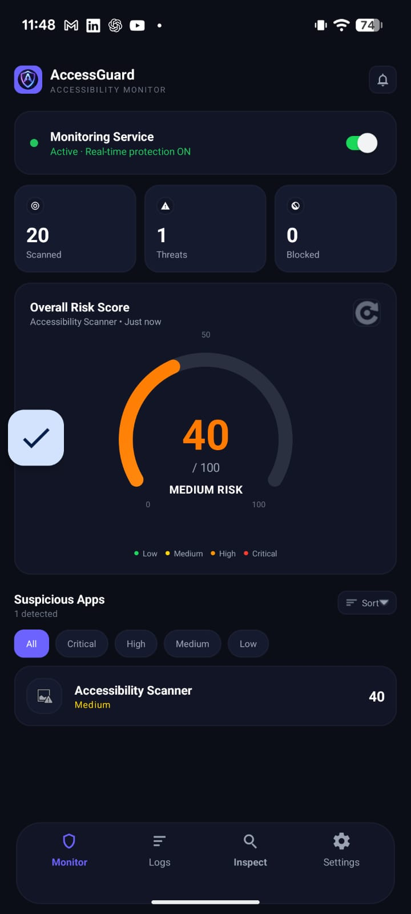
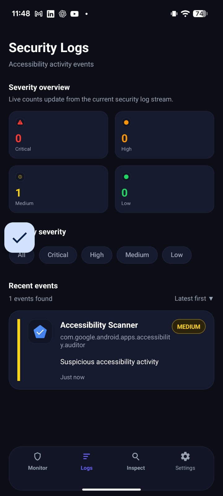
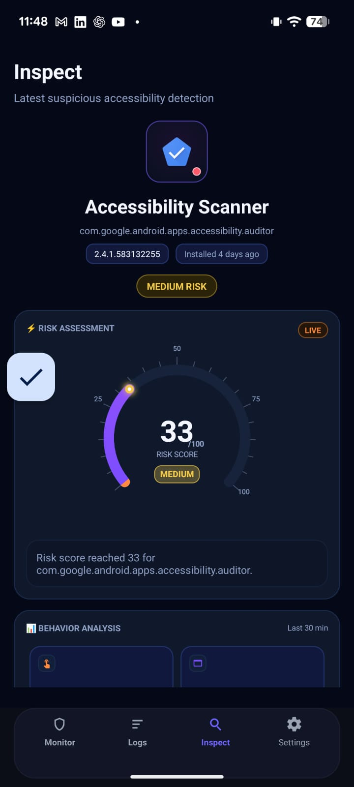
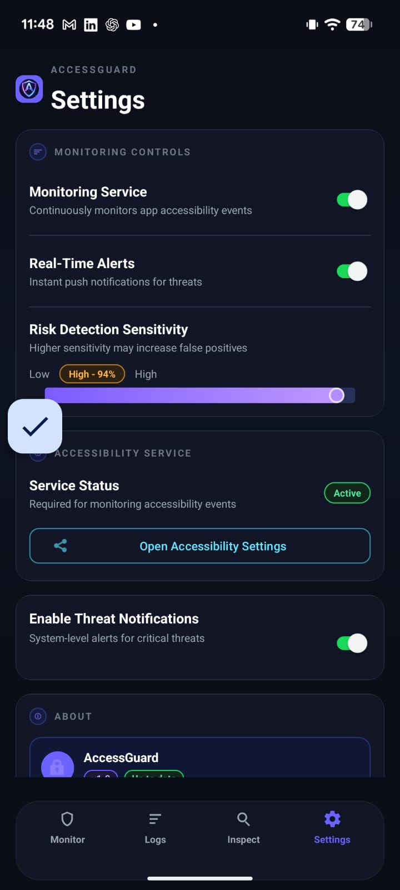

# Accessibility Guardian


Accessibility Guardian is an Android security monitoring application developed as an academic project to detect suspicious or abusive use of Android Accessibility features. The app monitors device and app behavior, evaluates risk through a rule-based detection engine, stores security evidence locally, and presents alerts, logs, and per-app inspection results through a mobile dashboard.

The application is designed around the idea that Android accessibility abuse can often be identified through behavior patterns rather than a single indicator. It combines foreground app monitoring, accessibility-state monitoring, package profiling, event correlation, and local risk scoring to surface potentially suspicious applications.

## Overview

Accessibility Guardian provides:

* Real-time monitoring of accessibility-related behavior
* Rule-based suspicious activity detection
* Risk scoring and severity classification
* Alert generation and recent alert viewing
* App-level inspection with timelines and behavior metrics
* Historical logs and severity filtering
* User decisions such as **Mark as Safe** and **Block App**
* Monitoring controls and notification-related settings

## Key Features

### 1. Real-time monitoring

The app uses a custom accessibility service and related monitoring components to observe:

* Accessibility state changes
* Foreground app transitions
* Package behavior patterns
* Notification-related signals
* Device integrity-related checks, including root detection and emulator detection

### 2. Device integrity protection

The app includes device integrity checks to detect insecure or analysis-friendly environments.
Implemented protections include:

* **Root detection**
* **Emulator detection**
* Integrity-driven enforcement flows for restricted app usage

These protections support the project goal of making the app behave more like a hardened security-sensitive application.

### 3. Rule-based detection engine

The core detection system is built around pluggable rules. Based on the project structure, the detection rules include:

* **NewAccessibilityServiceRule**
* **RecentInstallAccessibilityRule**
* **OverlayAccessibilityComboRule**
* **RapidUiAutomationRule**
* **OtpCorrelationRule**

These rules are evaluated through the detection engine and converted into risk outcomes and alerts. fileciteturn3file0

### 4. Risk scoring and severity assessment

The app includes a dedicated risk engine that:

* Aggregates rule outputs
* Produces risk assessments
* Classifies severity levels
* Updates dashboard risk state

Severity-oriented UI flows are used across the home dashboard, logs, and inspect views.

### 5. Alerts and recent alert popup

Accessibility Guardian supports:

* Immediate alert creation when suspicious behavior is detected
* Local alert persistence for later review
* A recent alerts dialog for quick viewing from the UI
* Notification support through an alert notifier utility and notification listener integration

### 6. Home dashboard

The monitor screen is designed to show key security information at a glance, including:

* Overall risk score
* Monitoring status
* Threat summary indicators
* Security state cards
* Suspicious application summaries
* Refreshable monitoring information

### 7. Detailed inspect screen

The inspect screen gives a focused analysis of a selected app. Based on your feature history and project structure, it includes:

* Latest detection summary
* App version information
* Installed date / age information
* Behavior detection cards
* Risk gauge visualization
* Recent events list
* Activity timeline using detection data
* Actions such as **Mark as Safe** and **Block App**

### 8. User trust and blocking actions

The app allows the user to make persistent decisions about suspicious apps:

* **Mark as Safe** stores a user trust decision
* Trusted apps can be suppressed from future alerts
* **Block App** supports user-driven response flows
* A dedicated blocked screen exists in the project

### 9. Logs and filtering

The logs module supports:

* Historical alert/event review
* Severity-based filtering
* Structured security log display
* Recent and past suspicious activity tracking

### 10. Settings and control options

The settings area supports operational controls such as:

* Enabling or disabling monitoring service state
* Real-time alert control
* Threat notification preferences
* Risk detection sensitivity
* State synchronization across monitoring-related switches and screens

## How It Works

1. The app monitors accessibility and foreground behavior through service and monitor components.
2. Runtime evidence is converted into a detection context.
3. Detection rules evaluate that context for suspicious patterns.
4. The risk engine calculates severity and risk score.
5. Alerts, snapshots, app profiles, and user decisions are stored locally.
6. UI screens display current state, historical logs, and per-app inspection results.

## Screens

### Home / Monitor Screen

Displays the current monitoring state and overall device/app risk summary.

### Logs Screen

Shows recorded alerts and events with severity filtering.

### Inspect Screen

Provides app-level analysis, recent detections, behavior metrics, and timeline details.

### Settings Screen

Allows users to configure monitoring, alerts, and related operational options.

### Recent Alerts Dialog

A dialog-based popup for viewing recent alerts directly from the app UI.

### Blocked Screen

A dedicated blocked-state screen is present in the project for handling blocked scenarios.

## Technology Stack

### Languages

* **Kotlin** – primary application logic
* **XML** – Android layouts and UI resources
* **SQL / Room entities and DAO patterns** – structured local persistence

### Frameworks and APIs

* Android SDK
* AndroidX / Jetpack components
* Accessibility Service API
* Notification listener integration
* Room persistence library
* Gradle with Kotlin DSL

## Project Architecture

The project follows a layered structure with separation between monitoring logic, persistence, and UI.

### `core/` – Security logic

Includes the main detection and monitoring pipeline:

* `engine/` – alert engine, detection rule engine, risk engine
* `model/` – detection and severity models
* `monitor/` – accessibility, foreground app, package, and integrity monitoring
* `rules/` – pluggable detection rules
* `service/` – monitoring services

### `data/` – Persistence layer

Stores operational and historical security data using Room:

* `dao/`
* `entities/`
* `repository/`
* database classes

### `ui/` – Presentation layer

Contains screen logic and custom visual components for:

* monitor/dashboard
* logs
* inspect
* settings
* custom gauges, cards, lists, and timelines

### `util/` – Shared utilities

Includes helpers for:

* permissions
* alert notifications
* monitoring preferences
* service coordination
* integrity-related blocking/termination support

## Main Components

Based on the current project structure, notable components include:

* `GuardianAccessibilityService`
* `GuardianNotificationListener`
* `AccessibilityStateMonitor`
* `ForegroundAppMonitor`
* `PackageProfileMonitor`
* `DeviceIntegrityMonitor`
* `AlertEngine`
* `DetectionRuleEngine`
* `RiskEngine`
* `SecurityRepository`
* `MonitorViewModel`
* `LogsViewModel`
* `InspectViewModel`
* `SettingsViewModel`
* `RecentAlertsDialogFragment`
* `BlockedActivity`

These components support monitoring, alerting, app inspection, blocked-state handling, and integrity protection including root/emulator detection. fileciteturn3file0 fileciteturn3file1 fileciteturn3file0 fileciteturn3file1

## Detection Rules Included

The detection layer currently includes:

* New accessibility service detection
* Recent app install + accessibility enablement correlation
* Overlay + accessibility abuse correlation
* Rapid UI automation detection
* OTP-related suspicious correlation

This rule set is represented directly by the rule implementation files in the project. fileciteturn3file0

## Local Database

The app uses Room-based local persistence. The database layer includes entities and DAOs for items such as:

* App profiles
* Event records
* OTP windows
* Risk snapshots
* Security alerts
* User decisions

This local storage supports historical security analysis, risk persistence, alert review, and user trust/block decisions.

## Testing and Debug Support

The project also includes:

* Unit tests for the detection engine, risk engine, and rule implementations
* Instrumentation testing support
* A debug detection test harness activity and view model

These components are visible in the project structure and initial commit file list. fileciteturn3file1

## Repository Structure

```text
AccessibilityGuardian/
├── app/
│   ├── src/
│   │   ├── main/
│   │   │   ├── java/com/sliit/isp/accessibilityguardian/
│   │   │   │   ├── core/
│   │   │   │   ├── data/
│   │   │   │   ├── ui/
│   │   │   │   └── util/
│   │   │   └── res/
│   │   ├── test/
│   │   └── androidTest/
│   ├── build.gradle.kts
│   └── proguard-rules.pro
├── build.gradle.kts
├── settings.gradle.kts
├── gradle/
└── gradlew
```

## Getting Started

### Requirements

* Android Studio
* Android SDK
* Gradle wrapper
* An Android device or emulator for testing

### Clone the repository

```bash
git clone https://github.com/YOUR_USERNAME/AccessibilityGuardian.git
cd AccessibilityGuardian
```

### Open in Android Studio

1. Open Android Studio
2. Choose **Open**
3. Select the `AccessibilityGuardian` project folder
4. Allow Gradle sync to finish

### Run the app

1. Connect an Android device or start an emulator
2. Click **Run** in Android Studio
3. Install the application
4. Grant the required permissions
5. Enable the accessibility service when prompted

## Basic Usage

1. Launch the app
2. Enable monitoring and required permissions
3. Allow the app to observe accessibility-related signals
4. Open the dashboard to review current risk state
5. Use the logs screen to review previous alerts
6. Open the inspect screen to analyze suspicious apps in detail
7. Use **Mark as Safe** or **Block App** based on the inspection result

## Screenshots

```markdown
## Screenshots
### Home



### Logs


### Inspect


### Settings

```

## Academic Context

This application was developed as an academic project in Android security. Its purpose is to demonstrate how accessibility-related abuse patterns can be monitored, scored, stored, and presented through a user-facing mobile interface.

## Future Improvements

Potential future enhancements include:

* Exportable security reports
* More advanced threat correlation rules
* Improved analytics and forensic summaries
* Production-grade threat intelligence integration
* Additional hardening policies beyond the current root and emulator detection

